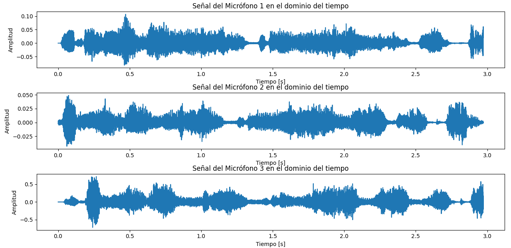
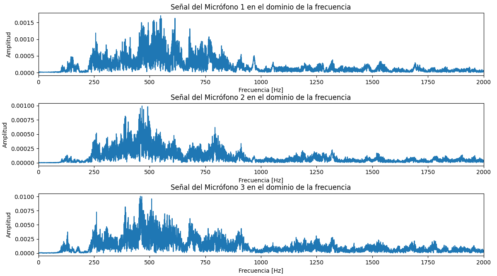
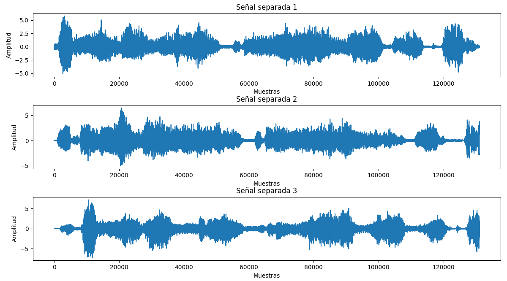

# Fiesta de cóctel (separacion de señales)
## Introducción
El laboratorio consistió en el desarrollo de un código en Python para el análisis, procesamiento y separación de señales de audio en archivos .wav. Se utilizaron tres micrófonos que captaron las voces de tres personas ubicadas de forma estratégica. En este informe se presenta tanto el análisis temporal de las señales de audio como el análisis espectral en el dominio de la frecuencia. Además, se implementaron dos métodos diferentes para separar las señales: Análisis de Componentes Independientes (ICA) y Beamforming.


## Tratamiento de la señales
Para iniciar el análisis, es importante aclarar que este repositorio contiene más de un solo código, lo cual se hizo para subdividir las tareas y mejorar la velocidad en el procesamiento. El primero de los códigos, denominado slab2.py, se encarga del procesamiento básico de las señales. El segundo, llamado slab2a.py, realiza el proceso de Análisis de Componentes Independientes (ICA) de los audios. Finalmente, el tercer código, slab2b.py, lleva a cabo el procesamiento a través de beamforming.
### Genral
```python
# Función para cargar un archivo .wav
def cargar_wav(file_path):
    sig, fs = sf.read(file_path)
    return sig, fs
```
Esta es la función más importante y se encuentra en todos los códigos, ya que es la encargada de cargar los archivos .wav utilizando la biblioteca sf.
```python
# Rutas a los archivos de audio de los tres micrófonos y el ruido ambiental
wavs = ["j1 cel1-e.wav", "j2 cel2-e.wav", "j3 cel3-e.wav"]
r = "rt-e.wav"

# Cargar señales desde los archivos .wav
sigs = []
muestras = []

for file_path in wavs:
    sig, fs = cargar_wav(file_path)
    # Asegurarse de que las señales sean unidimensionales
    if len(sig.shape) > 1:
        sig = sig[:, 0]
    sigs.append(sig)
    muestras.append(fs)

r_sig, fs_ruido = cargar_wav(r)

# Verificacion de que todas las señales posean la misma frecuencia de muestreo
if not all(fs == muestras[0] for fs in muestras):
    raise ValueError("Todas las señales deben tener la misma frecuencia de muestreo.")
if fs_ruido != muestras[0]:
    raise ValueError("La frecuencia de muestreo del ruido debe coincidir con las señales de los micrófonos.")

# Mantener la misma longitud
min_length = min(len(sig) for sig in sigs)
sigs = [sig[:min_length] for sig in sigs]
r_sig = r_sig[:min_length]
```
En esta sección de código, que también es compartida, se encarga de encontrar los audios y enviarlos a la función de extracción de valores. Además, hay secciones que se encargan de estandarizar las longitudes (muestras) de los audios. Este proceso no es tan importante para el laboratorio, ya que se utilizó la misma frecuencia de muestreo para grabar todos los audios; sin embargo, podría ser relevante si se desean procesar audios con diferentes frecuencias de muestreo, ademas tambien se comprueba que las señales sean de una sola dimension (mono).
### Primer codigo
```python
# Función para calcular la relación señal-ruido (SNR)
def snr(valores, ruido):
    fsum = 0
    ssum = 0
    potv = 0
    potr = 0

    # Calcular la potencia de la señal
    for x in valores:
        fsum += x ** 2
    potv = fsum / len(valores)
    
    # Calcular la potencia del ruido
    for x in ruido:
        ssum += x ** 2
    potr = ssum / len(ruido)

    # Calcular el SNR en decibelios
    return 10 * np.log10(potv / potr)

# Función para calcular la SNR de las señales separadas por FastICA
def snr_ica(sigs_ica, r_sig):
    snr_vals_ica = []
    for i, sig in enumerate(sigs_ica):
        snr_val = snr(sig, r_sig)
        snr_vals_ica.append(snr_val)
        print(f"SNR para la señal separada por FastICA {i+1}: {snr_val:.2f} dB")
    return snr_vals_ica
```
Las primeras funciones únicas del primer código se centran en calcular la relación entre la señal original y el ruido ambiente. Este proceso también se realiza con las señales extraídas mediante el proceso de ICA.
```python
# Calcular la SNR para cada micrófono
snr_vals = []
for i, sig in enumerate(sigs):
    snr_val = snr(sig, r_sig)
    snr_vals.append(snr_val)
    print(f"SNR para el Micrófono {i+1}: {snr_val:.2f} dB")

sigs_ica = []
for i in range(3):
    sig_ica, _ = cargar_wav(f'Voice_{i+1}.wav')
    sigs_ica.append(sig_ica[:min_length])
# Calcular la SNR para las señales separadas por ICA
snr_vals_ica = snr_ica(sigs_ica, r_sig)
```
Estos son los complementos detonantes para activar las funciones de SNR.

```python
# Análisis temporal
plt.figure(figsize=(12, 8))
for i, sig in enumerate(sigs):
    t = np.arange(len(sig)) / muestras[i]
    plt.subplot(3, 1, i + 1)
    plt.plot(t, sig)
    plt.title(f'Señal del Micrófono {i+1} en el dominio del tiempo')
    plt.xlabel('Tiempo [s]')
    plt.ylabel('Amplitud')
plt.tight_layout()
plt.show()

# Análisis espectral o en frecuencia(FFT)
plt.figure(figsize=(12, 8))
for i, sig in enumerate(sigs):
    n = len(sig)
    yf = fft(sig)
    xf = fftfreq(n, 1 / muestras[i])[:n//2]
     # Filtrar las frecuencias fuera del rango de interés en este caso de 0 a 2000 hz
    lim_inf = 0
    lim_sup = 2000
    indices = np.where((xf >= lim_inf) & (xf <= lim_sup))
    xf_f = xf[indices]
    yf_f = 2.0/n * np.abs(yf[:n//2][indices])
    
    plt.subplot(3, 1, i + 1)
    plt.plot(xf_f, yf_f)
    plt.title(f'Señal del Micrófono {i+1} en el dominio de la frecuencia')
    plt.xlabel('Frecuencia [Hz]')
    plt.ylabel('Amplitud')
    plt.xlim(lim_inf, lim_sup)
plt.tight_layout()
plt.show()
```
Por último, para el primero de los códigos, tenemos las funciones que se encargan de graficar tanto las señales básicas extraídas de los archivos .wav como, a través de la transformada de Fourier, el espectro de frecuencias.
### Segundo codigo
En el segundo codigo se realiza un análisis a través de componentes independientes (ICA), que se encarga de descomponer las señales multicanal en componentes independientes. Esto tiene el propósito de separar las señales emitidas por las fuentes y registradas en los micrófonos, ademas de este proceso tambien grafica las señales ya tratadas.
```python
# Convertir las señales a una matriz de mezclas
X = np.array(sigs).T

# Aplicar FastICA
ica = FastICA(n_components=3)  # 3 fuentes independientes
S_ = ica.fit_transform(X)  # Fuentes estimadas
A_ = ica.mixing_  # Matriz de mezclado estimada

# Guardar las señales separadas como archivos .wav
fs = muestras[0]  # Usar la frecuencia de muestreo común
for i in range(S_.shape[1]):
    sf.write(f'Voice_{i+1}.wav', S_[:, i], fs)

# Graficar las señales originales y separadas
plt.figure(figsize=(12, 8))
for i in range(3):
    plt.subplot(3, 1, i + 1)
    plt.plot(S_[:, i])
    plt.title(f'Señal separada {i+1}')
    plt.xlabel('Muestras')
    plt.ylabel('Amplitud')
plt.tight_layout()
plt.show()
```
### Tercer codigo
En el último código se realiza un análisis de las señales mediante beamforming, teniendo en cuenta las posiciones relativas. Este proceso se utiliza para procesar señales en direcciones específicas y se basa en el uso de múltiples señales captadas por varios receptores o emisores, como micrófonos o antenas. En este caso, el proceso se realizó utilizando la disposición espacial para dirigir las señales en direcciones específicas.
Es importante destacar que las dimensiones se ubicaron en un plano bidimensional, donde el primer micrófono se sitúa en el origen del plano (0,0).

```python
# Parámetros del beamformer
c = 343  # Velocidad del sonido en el aire (m/s)

# Posiciones de los micrófonos (en metros)
mic_positions = np.array([
    [0, 0],  # Micro 1
    [1.16, 1.16], # Micro 2
    [2.32, 0] # Micro 3
]) 

# Posiciones de las fuentes (en metros)
source_positions = np.array([
    [1.16, 0],  # Persona 1
    [0, 1.16],  # Persona 2
    [2.32, 1.16]  # Persona 3
])

# Función para alinear señales según los retardos
def align_sigs(sigs, mic_positions, source_positions, fs):
    num_sources = len(source_positions)
    aligned_sigs = np.zeros((num_sources, len(sigs[0])))
    
    for i, src_pos in enumerate(source_positions):
        delays = np.zeros(len(mic_positions))
        for j, mic_pos in enumerate(mic_positions):
            distance = np.linalg.norm(mic_pos - src_pos)
            delays[j] = distance / c
        
        # Aplicar los retardos a las señales
        delay_samples = np.round(delays * fs).astype(int)
        aligned_sigs[i] = np.zeros(len(sigs[0]))
        for j in range(len(sigs)):
            sig = sigs[j]
            aligned_sigs[i] += np.roll(sig, int(-delay_samples[j]))[:len(sig)]
    
    return aligned_sigs

# Aplicar el beamforming para alinear las señales
aligned_sigs = align_sigs(sigs, mic_positions, source_positions, muestras[0])

# Guardar las señales separadas como archivos .wav
fs = muestras[0]  # Usar la frecuencia de muestreo común
for i in range(aligned_sigs.shape[0]):
    sf.write(f'beamformed_{i+1}.wav', aligned_sigs[i], fs)

# Graficar las señales separadas
plt.figure(figsize=(12, 8))
for i in range(aligned_sigs.shape[0]):
    plt.subplot(3, 1, i + 1)
    plt.plot(aligned_sigs[i])
    plt.title(f'Señal separada por Beamforming {i+1}')
    plt.xlabel('Muestras')
    plt.ylabel('Amplitud')
plt.tight_layout()
plt.show()
```
## Resultados 
Los codigos realizados cuentan con difereentes funciones que se encargan de graficar las funciones en sus didferentes estados.



En esta gráfica se puede observar el sonido teniendo en cuenta su amplitud y el tiempo de la grabación. Como se evidencia en las tres gráficas, se muestran los audios grabados con diferentes celulares. Cabe aclarar que el uso de distintos micrófonos influye significativamente, ya que la tercera muestra presenta una mayor amplitud y está menos afectada por el ruido. Si comparamos, podemos ver que las señales de las dos primeras están más contaminadas y tienen, en promedio, una amplitud 10 veces menor. Esto influyó en los resultados obtenidos tanto en el análisis ICA como en el beamforming.



Por otro lado, la siguiente gráfica muestra la amplitud con respecto a la frecuencia, la cual se obtuvo al realizar la transformada de Fourier sobre las señales extraídas de los archivos .wav. En esta gráfica se puede evidenciar que las voces humanas están en el rango de los 300 a 2000 Hz.



Este gráfico representa las señales tras ser procesadas por el método ICA. Al escuchar los audios producidos por este proceso, se puede evidenciar que en cada uno de ellos una voz es más pronunciada. Sin embargo, hay una considerable distorsión y filtración de las otras voces en las grabaciones. Posiblemente, estos problemas se deban al uso de diferentes micrófonos.
