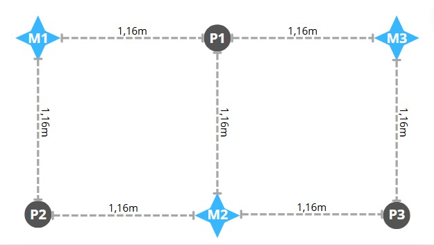

# Fisesta de coctel (separacion de señales)
## Introducción
El laboratorio consistió en el desarrollo de un código en Python para el análisis, procesamiento y separación de señales de audio en archivos .wav. Se utilizaron tres micrófonos que captaron las voces de tres personas ubicadas de forma estratégica. En este informe se presenta tanto el análisis temporal de las señales de audio como el análisis espectral en el dominio de la frecuencia. Además, se implementaron dos métodos diferentes para separar las señales: Análisis de Componentes Independientes (ICA) y Beamforming.

